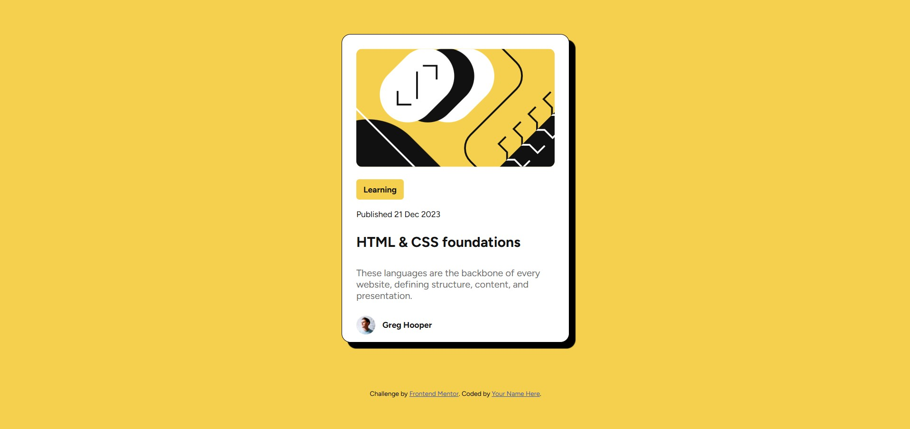
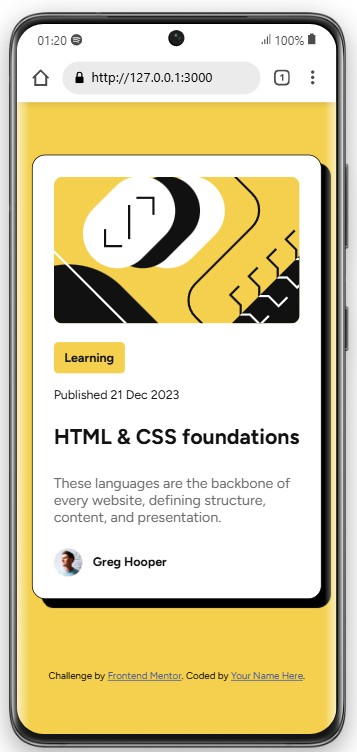

# Frontend Mentor - Blog preview card solution

This is a solution to the [Blog preview card challenge on Frontend Mentor](https://www.frontendmentor.io/challenges/blog-preview-card-ckPaj01IcS). Frontend Mentor challenges help you improve your coding skills by building realistic projects. 

## Table of contents

- [Frontend Mentor - Blog preview card solution](#frontend-mentor---blog-preview-card-solution)
  - [Table of contents](#table-of-contents)
  - [Overview](#overview)
    - [The challenge](#the-challenge)
    - [Screenshot](#screenshot)
    - [Links](#links)
  - [My process](#my-process)
    - [Built with](#built-with)
    - [What I learned](#what-i-learned)
    - [Continued development](#continued-development)
  - [Author](#author)
## Overview
this project is good for learning box model and html structure, sementic html tag

### The challenge

Users should be able to:

- See hover and focus states for all interactive elements on the page

### Screenshot





### Links

- Solution URL: [Add solution URL here](https://your-solution-url.com)
- Live Site URL: [Add live site URL here](https://your-live-site-url.com)

## My process

### Built with

- Semantic HTML5 markup
- CSS custom properties
- Flexbox


### What I learned

i learned how to used sementic element, how to structure layout using flext and width margin and padding properties.

```html
<div class="card">
      <header>
        
      </header>
      <main>
        <span>Learning</span>
        <p>Published 21 Dec 2023</p>
        <h1>HTML & CSS foundations</h1>
        <p>These languages are
    the backbone of every website, defining structure, content, and
    presentation.</p>
      </main>
      <footer>
        
        <p>Greg Hooper</p>
      </footer>
    </div>
```
```css
@font-face {
  font-family: "figtree"; /* Choose a descriptive name for your font */
  src: url("./assets/fonts/Figtree-VariableFont_wght.ttf") format("truetype");
  font-style: normal;
}
*,
*::before,
*::after {
  box-sizing: border-box;
  margin: 0;
  padding: 0;
}
body {
  font-family: "figtree";
  font-style: normal;
  max-width: 1440;
  height: 100vh;
  display: flex;
  flex-direction: column;
  justify-content: center;
  align-items: center;
  background-color: hsl(47, 88%, 63%);
  gap: 5em;
}
.card {
  background-color: hsl(0, 0%, 100%);
  width: 384px;
  height: 522px;
  display: flex;
  flex-direction: column;
  border: 1px solid rgb(0, 0, 0);
  border-radius: 15px;
  color: hsl(0, 0%, 7%);
  box-shadow: 10px 10px 1px rgb(0, 0, 0);
}
header {
  flex: 1 1 100%;
  padding: 24px 24px 0 24px;
}
header img {
  width: 100%;
  border-radius: 10px;
}
main {
  flex: 1 1 100%;
  padding: 24px 24px 0 24px;
}
main span {
  background-color: hsl(47, 88%, 63%);
  padding: 9px 12px;
  border-radius: 5px;
  font-size: 14px;
  font-weight: bold;
}
main p:nth-of-type(1) {
  margin-top: 24px;
  font-size: 14px;
}

main h1 {
  font-size: 24px;
  margin-top: 24px;
  width: 100%;
  margin-bottom: 28px;
}
main h1:hover{
    color: hsl(47, 88%, 63%);
    cursor: pointer;
}
main p:nth-of-type(2) {
  margin-top: 24px;
  font-size: 16px;
  color: hsl(0, 0%, 42%);
}
footer {
  flex: 1 1 100%;
  display: flex;
  gap: 12px;
  justify-content: start;
  align-items: center;
  margin: 24px 0 24px 24px;
}
footer img {
  width: 32px;
  height: 32px;
}
footer p {
  font-size: 14px;
  font-weight: bold;
}

@media (max-width: 377px) {
  .card {    
    width: 327px;
    height: 501px;
    margin-left: 24px;
    margin-right: 24px;
  }
}

```

### Continued development

i will be extending this blog preview using grid layout and use some animation and do this using utility classes in coming days

## Author

- Website - [Add your name here](https://www.your-site.com)
- Frontend Mentor - [@alamscode-rgb](https://www.frontendmentor.io/profile/yourusername)
- Twitter - [@alamscode](https://www.twitter.com/alamscode)

